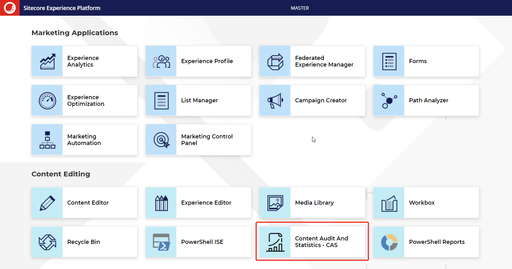
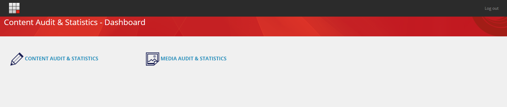
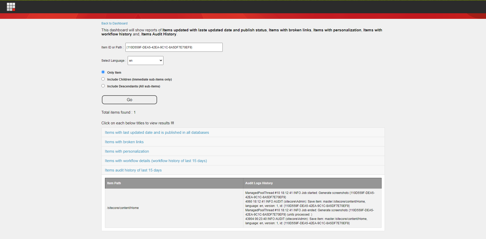

  
# Hackathon Submission Entry form
## Team name
**Access Denied**
⟹ Khushboo Sorthiya
⟹ Sreekrishnan K S
⟹ Brijesh Patel

## Category
⟹ The best enhancement to Sitecore Admin (XP) for Content Editors & Marketers

## Description
⟹ Write a clear description of your hackathon entry.  

  - Module Purpose
  - What problem was solved (if any)
    - How does this module solve it

## Video link
⟹ Provide a video highlighing your Hackathon module submission and provide a link to the video. You can use any video hosting, file share or even upload the video to this repository. _Just remember to update the link below_

⟹ [Replace this Video link](#video-link)

## Installation instructions

1. Use the Sitecore Installation wizard to install package.
2. Login to Sitecore having an administrator role.
3. From Sitecore Launchpad open Desktop.
4. Navigate to Start Menu -> Development Tools -> Installation Wizard.
5. Download  [CAS](https://github.com/Sitecore-Hackathon/2021-Access-Denied/blob/main/package/CAS%20Dashboard-1.0.zip) Sitecore Package.
6. Using upload package upload it to sitecore.
7. Once upload is complete click next.
8. Click on Install button of "Install a Package" dialog.

## Usage instructions
⟹ Once a user is logged into Sitecore using /sitecore/login url, "Content Audit And Statistics - CAS" button is available which navigates a user to CAS Dashboard page.

⟹ From CAS Dashboard page, a content author can navigate to "Content Audit & Statistics" or "Media Audit & Statistics" pages

⟹ On Content Audit & Statistics page,
- Enter Sitecore Item ID or Path
- Select Language
- Select if audit or stats for selected item, immediate children or descendants is required. Hit Go button to look at the generated report.

## Comments
If you'd like to make additional comments that is important for your module entry.
