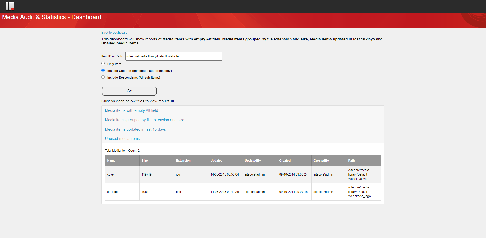

# Sitecore Hackathon 2021

- MUST READ: **[Submission requirements](SUBMISSION_REQUIREMENTS.md)**
- [Entry form template](ENTRYFORM.md)
- [Starter kit instructions](STARTERKIT_INSTRUCTIONS.md)
  
# Hackathon Submission Entry form
## Team name
**Access Denied**
⟹ Khushboo Sorthiya
⟹ Sreekrishnan K S
⟹ Brijesh Patel

## Category
⟹ The best enhancement to Sitecore Admin (XP) for Content Editors & Marketers

## Description
⟹ Write a clear description of your hackathon entry.  

  - Module Purpose
	  - The major dilemma of all content authors is to get the stats of content and media that has been developed as part of the application. Most areas which we have heard about are "Knowing when was the item last published", "Getting audit logs for the item (like last saved and last published)", Getting the largest media item, Getting media items that are not being used by any of the contetn item etc.
  - What problem was solved (if any)
	  - We have Sitecore Powershell Extensions, one of the best reporting module available in the Sitecore market, but we wanted to develop something that assembles all the details under a single place which would be easily accessed by Content Authors and the details could be further used for troubleshooting or informational purposes.
    - How does this module solve it
	    - CAS module provides following reports for content items and media items:
	    - Content Items: **Items updated with last updated date and publish status**,  **Items with broken links**,  **Items with personalization**,  **Items with workflow history**  and,  **Items Audit History**.
	    - Media Items: **Media items with empty Alt field**,  **Media items grouped by file extension and size**,  **Media items updated in last 15 days**,  **Unused media items**.

## Video link

⟹ [Content Audit & Statistics - CAS](https://youtu.be/3VHIPGHizX8)

## Installation instructions

1. Use the Sitecore Installation wizard to install package.
2. Login to Sitecore having an administrator role.
3. From Sitecore Launchpad open Desktop.
4. Navigate to Start Menu -> Development Tools -> Installation Wizard.
5. Download  [CAS](https://github.com/Sitecore-Hackathon/2021-Access-Denied/blob/main/package/CAS%20Dashboard-1.0.zip) Sitecore Package.
6. Using upload package upload it to sitecore.
7. Once upload is complete click next.
8. Click on Install button of "Install a Package" dialog.

## Usage instructions
⟹ Once a user is logged into Sitecore using /sitecore/login url, "Content Audit And Statistics - CAS" button is available which navigates a user to CAS Dashboard page.

⟹ From CAS Dashboard page, a content author can navigate to "Content Audit & Statistics" or "Media Audit & Statistics" pages

⟹ On Content Audit & Statistics page,
- Enter Sitecore Item ID or Path
- Select Language
- Select if audit or stats for selected item, immediate children or descendants is required. Hit Go button to look at the generated report.
	- Content Audit & Statistics
	
	- Media Audit & Statistics
	
